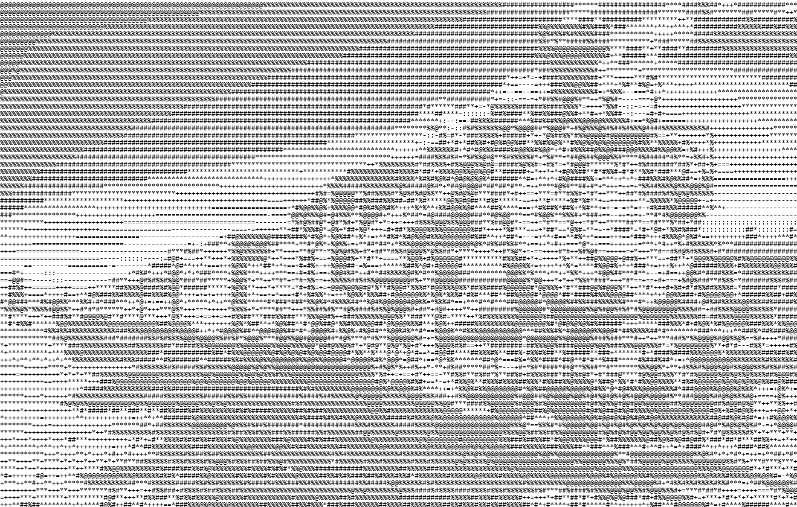

<!--Use Ctrl+Shift+V to toggle .md visualization on vscode (default shortcut, Pausebreak personally)-->

# **Terminal Train** _<small>the game</small>_

``` text
                   +[Intro]+               [B]               [C]               [D]
==================☰☰☰[]☰☰☰======================================================================
```

### A terminal-based train management game developed in Python, created to study DSA concepts and software architecture.
### _*Project under development!_
#

## Como testar o `.exe` no GitHub

1. Faça o build local com PyInstaller:

```powershell
pyinstaller --onefile --add-data "Sons;Sons" --add-data "Animacoes;Animacoes" main.py
```

2. O executável fica em `dist\main.exe`.
3. Para facilitar o envio, compacte em ZIP:

```powershell
Compress-Archive -Path .\dist\main.exe -DestinationPath main.zip
```

4. Crie uma Release no GitHub e anexe `main.exe` ou `main.zip` como asset.
5. Compartilhe o link da Release com seu amigo.
6. Ele baixa o arquivo, extrai se necessário e executa `main.exe`.

> Se o Windows bloquear, escolha **Mais informações** e depois **Executar assim mesmo**.

## Build automático com GitHub Actions

O workflow `Build Windows exe` em `.github/workflows/build.yml` cria o `.exe` automaticamente quando você criar uma tag `v*` ou executar o workflow manualmente.

Para gerar uma release com tag, use:

```powershell
git tag v1.0.0
git push origin v1.0.0
```

Depois acesse a aba Actions no GitHub e baixe o artefato `JogoTrem-exe`.

<picture>
  <source alt="Font: https://wallpaperaccess.com/full/837955.jpg" media="(prefers-color-scheme: dark)" srcset="Animacoes/img/dark_theme_train.png" width=100%>
  
</picture>